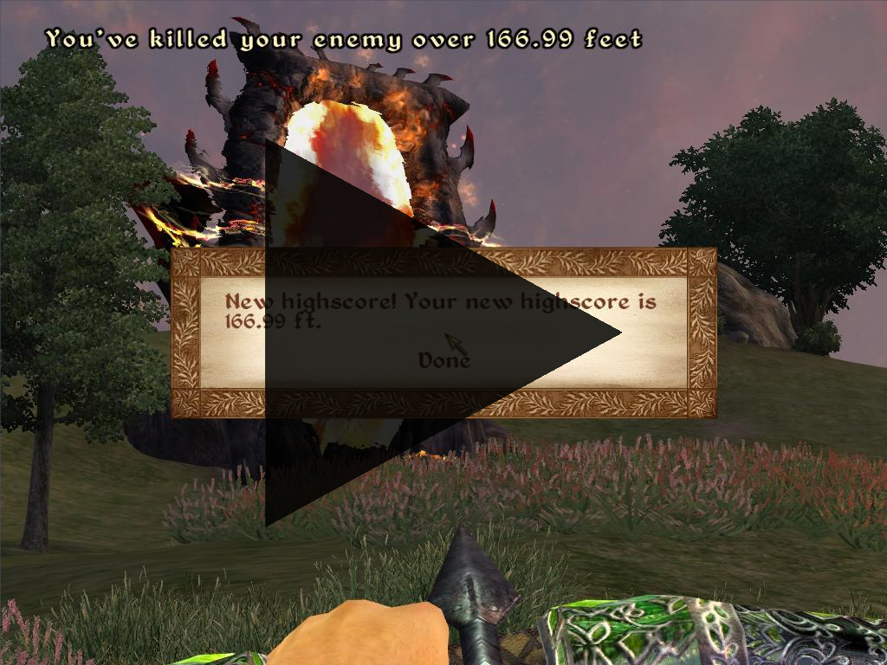

# Readme for sinHHHans Distant Mod
See this ingame video of the Mod:

## Description

This Mod calculates the distance over which you have striked down an enemy by bow. 
The distance is shown as a message in the top of the screen. Feet and meters are supported and can be configured ingame. 
There is also a highscore, that always keeps track of your best(=farthest) shot.

A kill over 160.85 meters will give you a surprise ;-)

## Installation
Place the .esp file to directory `\Oblivion\Data\`

## Uninstallation
Delete the contained .esp file from `\Oblivion\Data\`

## First run

On first run, you as the player get some get an item added in your inventory which can be used for configuring the mod.
You can change the configuration between meters and feet for example.

## Credits
- guidobot101
- Dark
- entim
- DarkWarrior 
- André
- www.TesSource.com 
- Bethesda